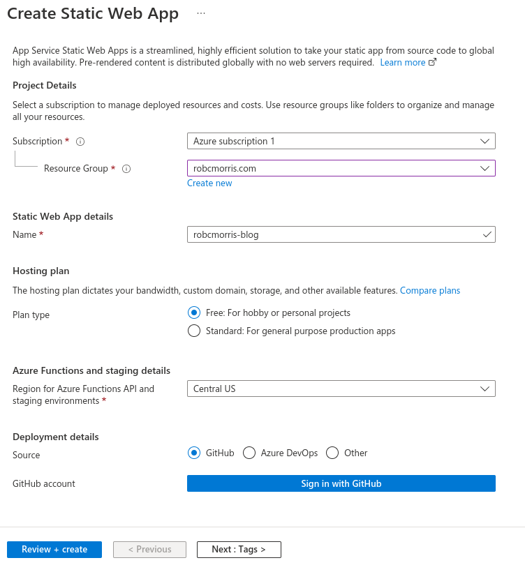
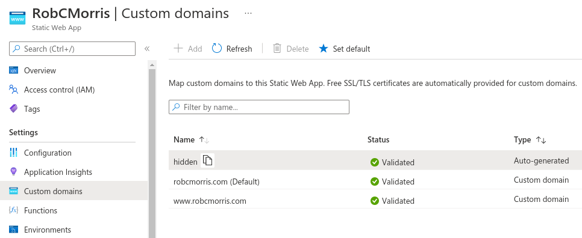
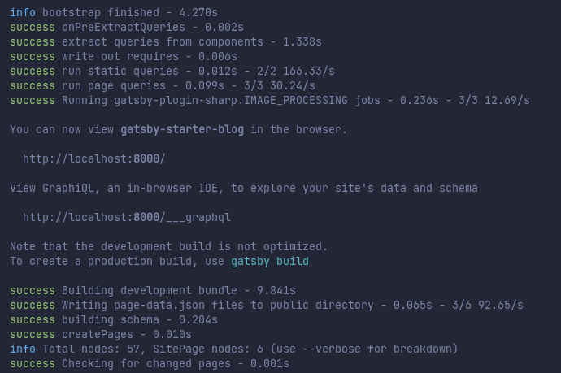
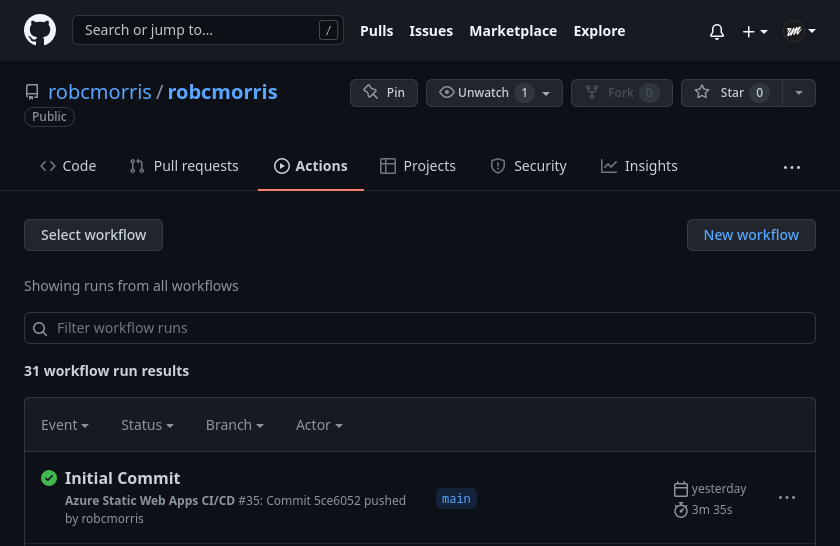
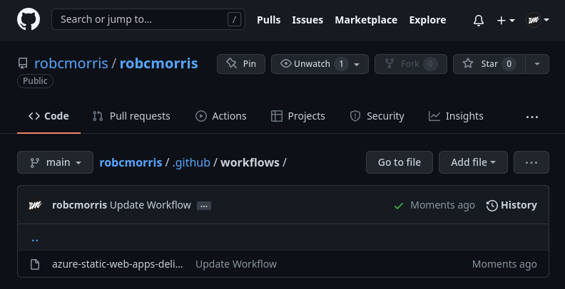

This blog is a 'Hello, World' project using [Gatsby](https://www.gatsbyjs.org), hosted in [Azure Static Web Apps](https://docs.microsoft.com/en-us/azure/static-web-apps/overview), with a CI/CD workflow with [GitHub Actions](https://github.com/features/actions) connected to my custom domain. 

## Couple things to note about pricing:

- **Gatsby**: [Open Source](https://www.gatsbyjs.com/contributing). _Need I say more?_
- **Azure Static Web Apps**: Has [Free Tier](https://azure.microsoft.com/en-us/pricing/details/app-service/static/) which allows using a custom domain, and provides free SSL certificates.
- **GitHub Actions**: [Free Tier](https://github.com/pricing) includes 2,000 CI/CD minutes/month.
- **Domain Name**: You could get one free...

## Prerequisites

- An [Azure account](https://azure.microsoft.com/) with an active subscription.
- A [GitHub account](https://github.com).
- [Node.js](https://nodejs.org) installed.
- Git

## Setup Gatsby Blog Starter App

Gatsby has a bunch of [Starters](https://www.gatsbyjs.com/starters/) you can use to get going. I used the [Gatsby Blog Starter](https://www.gatsbyjs.com/starters/gatsbyjs/gatsby-starter-blog/).

Create a Gatsby app using the Gatsby Command Line Interface (CLI):

1. Open a terminal.
1. Use the [npx](https://www.npmjs.com/package/npx) tool to create a new app with the Gatsby CLI. This may take a few minutes.

   ```bash
   npx gatsby new gatsby-starter-blog https://github.com/gatsbyjs/gatsby-starter-blog
   ```

1. Navigate to the newly created app.

   ```bash
   cd gatsby-starter-blog
   ```

1. Initialize a Git repo.

   ```bash
   git init
   git add -A
   git commit -m "initial commit"
   ```

## Push your application to GitHub

You need to have a repository on GitHub to create a new Azure Static Web Apps resource.

1. Create a blank GitHub repository (don't create a README) from [https://github.com/new](https://github.com/new) named **gatsby-starter-blog**.

1. Next, add the GitHub repository you just created as a remote to your local repo. Make sure to add your GitHub username in place of the `<YOUR_USER_NAME>` placeholder in the following command.

   ```bash
   git remote add origin https://github.com/<YOUR_USER_NAME>/gatsby-starter-blog
   ```

1. Push your local repository up to GitHub.

   ```bash
   git push --set-upstream origin main
   ```

## Deploy your Gatsby Starter Blog

Next lets add our repo as a Static Web App in Azure.

### Create the application in Azure

1. Navigate to the [Azure portal](https://portal.azure.com)
1. Select **Create a Resource**
1. Search for **Static Web Apps**
1. Select **Static Web Apps**
1. Select **Create**
1. On the _Basics_ tab, enter the following values.

    | Property | Value |
    | --- | --- |
    | _Subscription_ | Your Azure subscription name. |
    | _Resource group_ | **my-gatsby-group**  |
    | _Name_ | **gatsby-starter-blog** |
    | _Plan type_ | **Free** |
    | _Region for Azure Functions API and staging environments_ | Select a region closest to you. |
    | _Source_ | **GitHub** |

1. Select **Sign in with GitHub** and authenticate with GitHub.

1. Enter the following GitHub values.

    | Property | Value |
    | --- | --- |
    | _Organization_ | Select your desired GitHub organization. |
    | _Repository_ | Select **gatsby-starter-blog**. |
    | _Branch_ | Select **main**. |

1. In the _Build Details_ section, select **Gatsby** from the _Build Presets_ drop-down and keep the default values.

Now I used my own info below, but this is what I ended up with:



### Review and create

1. Select the **Review + Create** button to verify the details are all correct.

1. Select **Create** to start the creation of the App Service Static Web App and provision a GitHub Actions for deployment.

1. Once the deployment completes click, **Go to resource**.

1. On the resource screen, click the _URL_ link to open your deployed application. You may need to wait a minute or two for the GitHub Actions to complete.

## Connect Custom Domain

You you should now have a site up and running ready to add your custom domain name to it. Head to **Custom Domain Names** under your Resource.

You can find this in your Azure Portal Under if you get lost: **All 
Services > Web > Static Web Apps > gatsby-starter-blog > Custom Domain Names**

You can visit the **.azurestaticapps.net** page your app already has if you want. 

From here you can hit **Add**.



With the free plan they let you add two domain names. That will be your Apex domain and your WWW. 

This step will be dependent on your Domain Registrar but the directions on the are available in the [Set up a custom domain in Azure Static Web Apps](https://docs.microsoft.com/en-us/azure/static-web-apps/custom-domain-external) documentation.

## Development Time

Now its time to customize the blog. You can refer to the [Gatsby Starter Blog GitHub](https://github.com/gatsbyjs/gatsby-starter-blog) and the [Gatsby Documentation](https://www.gatsbyjs.com/) for more info but this is where you'll need to go wild exploring the files and folders in the **gatsby-starter-blog** folder.

1. Back in your terminal window we should still be in your **gatsby-starter-blog** folder.

1. We can use the [Gatsby CLI](https://www.gatsbyjs.com/docs/reference/gatsby-cli/) to run a development environment. Lets install it:

   ````bash
   npm install -g gatsby-cli
   ````
1. Now run the development environment Gatsby provides:
   
   ````bash
   gatsby develop
   ````

1. After a short moment you should be prompted that "You can now view **gatsby-starter-blog** in the browser":

   

1. Open up your browser and navigate to http://localhost:8000/ and you should have a live reloading version of your site that automatically updates with changes.

1. At this point you can start creating blogs and customizing the code of your site. Once you're happy with everything add the changes to GitHub.

   ````bash
   git add -A
   ````
1. Now add a commit message

   ````bash
   git commit -m "Updated Blog"
   ````
1. Check your GitHub for a running Action.



## Conclusion

When you link your GitHub in Azure and set your repository you'll notice that it automagically adds a **GitHub Actions** workflow to your repository based on the build preset you picked. You'll probably want to look around in that file.



At this point the process is simple. Create a new blog or edit code, commit the changes to GitHub, and the Action will build out your static website and serve it over to Azure.

I've tested out a few different Static Site Generators in Azure and had them set up in minimal time once you get the hang of it. Its not the worst way to run a blog.

I might try to go full "Progressive Web App" at some point, but this will work for now.If you have any question, feel free to hit me up on [GitHub](https://github.com/robcmo/).

Hello, World! 👋